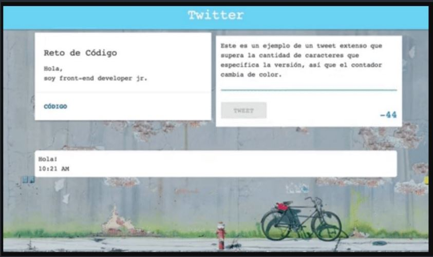

# Replica de Twitter

* **Track:** _Common Core_
* **Curso:** _Creando un sitio web interactivo con JavaScript_
* **Unidad:** _Creando interacción con JavaScript_

## Objetivo
---
El reto consiste en replicar el sitio de **Twitter**, según una secuencia de versiones que van asemejando cada vez más a la página original. Este será el resultado
a lograr:

## Versiones Solicitadas
---
### Versión 0.0.1

* Diseñar un formulario que permita ingresar un texto y un botón para "twittear".
* Agregar un evento de click al botón o de submit al formulario.
* En el evento, obtener el texto.
* Agregar el texto al HTML.

### Versión 0.0.2

* No ingresar texto vacío (deshabilitar el botón de "twittear").
* Contar la cantidad de caracteres de forma regresiva.

### Versión 0.0.3

* Si pasa los 140 caracteres, deshabilitar el botón.
* Si pasa los 120 caracteres, mostrar el contador con OTRO color.
* Si pasa los 130 caracteres, mostrar el contador con OTRO color.
* Si pasa los 140 caracteres, mostrar el contador en negativo.

### Versión 0.0.4

* Al presionar enter(/n) que crezca el textarea de acuerdo al tamaño del texto.

### Versión 0.0.5 (Extra)

* Si la cantidad de caracteres ingresados (sin dar un enter), supera al tamaño del textarea por defecto, debe de agregarse una línea más para que no aparezca el scroll. (Si en caso aplica)

### Versión 0.0.6 (Extra)

* Agregar la hora en que se publicó el tweet. En el formato de 24 horas: hh:mm.
* Nota: Para dar formato a la fecha y hora, puedes crear tu propia función o usar una librería como moment.js.

## Contenido

Este proyecto contiene:

1. Un archivo `index.html` que contiene la estructura inicial de la página web. Este debe contener las siguientes secciones:

  * El cuerpo de la página web estará cubierto por una imagen de fondo.
  * Un encabezado de fondo celeste con "Twitter" como título en el centro.
  * Dos cajas al mismo nivel. A la izquierda, se ubica la información del reto de código que simula el área donde se suele ubicar los datos del usuario de Twitter. A la derecha, se ubica el área donde se ingresará los tweets a hacer por medio de un formulario con un área para ingresar texto y un botón para hacer los tweets.
  * Un contenedor donde irán apareciendo los tweets.

2. Una carpeta `assets` donde se encuentra la carpeta `images` con la imagen de fondo de la página web en formato ***jpg***.

3. Una carpeta `css` que contiene un archivo `main.css` donde hay clases reutilizables y específicas para darle estilo a la página web.

4. Una carpeta `docs` que contiene la imagen en formato ***jpg*** de la página web a replicar.

5. Una carpeta `js` que contiene un archivo `app.js` donde se encuentra el código que le brinda funcionalidad a la página.

6. Un archivo  **`README.md`** que explica el contenido del repositorio.

## Autora
Lizbeth Félix Peña

## Fecha
19/11/2017
